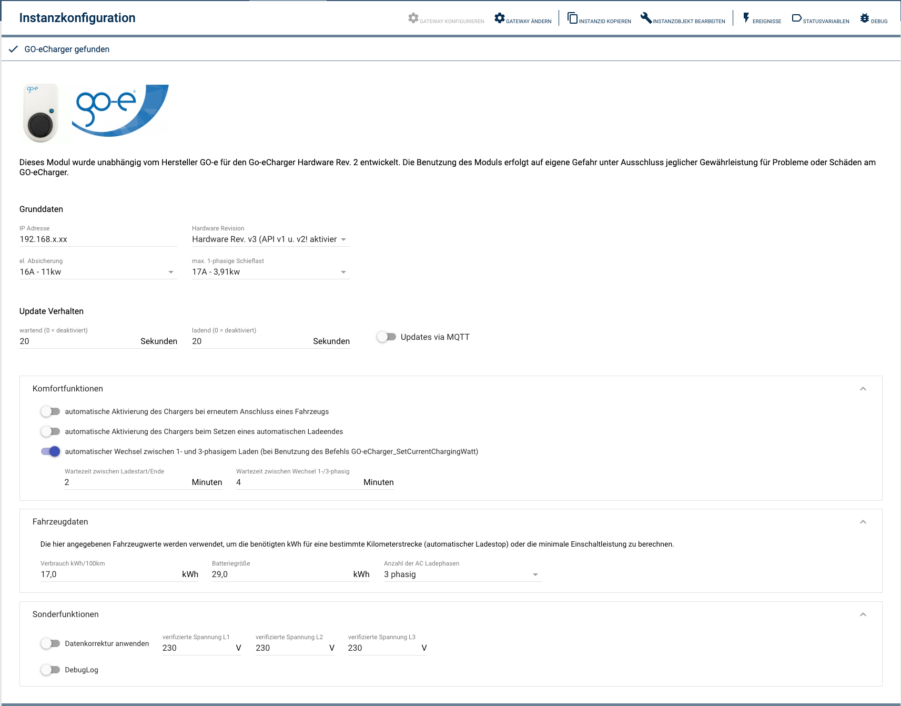

### IP-Symcon Modul für die GO-eCharger Wallbox


PHP-Modul zur Einbindung einer [GO-eCharger Wallbox](www.go-e.co) in IPSymcon. 

Nutzung auf eigene Gefahr ohne Gewähr. Das Modul kann jederzeit überarbeitet werden, so daß Anpassungen für eine weitere Nutzung notwendig sein können. Bei der Weiterentwicklung wird möglichst auf Kompatibilität geachtet. 

Das Modul ist ein Hobby. Wer sich mit einer kleinen Spende für dessen Entwicklung (ohne Recht auf irgendwelche Ansprüche) bedanken möchte, kann dies gerne via Paypal-Spende machen:

<a href="https://www.paypal.com/donate/?hosted_button_id=LAZR2DLZ2E6SU"></a>

## Dokumentation

**Inhaltsverzeichnis**

1. [Funktionsumfang](#1-funktionsumfang) 
2. [Systemanforderungen](#2-systemanforderungen)
3. [Installation](#3-installation)
4. [Module](#4-module)
5. [Tips&Tricks](#5-tips--tricks)
6. [ChangeLog](#6-changelog)

## 1. Funktionsumfang

Das Modul ist dazu gedacht die [GO-eCharger Wallbox](www.go-e.co) zum Laden von Elektrofahrzeugen in [IP-Symcon](www.ip-symcon.de) einzubinden. 

Es soll sowohl Zustandsdaten (Anschluss, Ladevorgang, etc.) als auch Schaltaktionen (Ladevorgang starten/stoppen, Ladeströme setzen) zur Verfügung stellen.
Über die Zeit hat GO-e unterschiedliche Firmwares geliefert. Nicht jede Funktion bzw. jeder Wert steht in jeder Firmware zur Verfügung. Typischerweise werden z.B. neue Werte hinzugefügt. So kann es vorkommen, das es Attribute gibt, die nie aktualisiert werden. Dies ist kein Fehler.

## 2. Systemanforderungen
- IP-Symcon ab Version 4.x

## 3. Installation

### Vorbereitung des go-eChargers
Vor der Installation des Moduls in IPSymcon muss der go-eCharger vollständig eingerichtet sein. Da dieses Modul lokal auf den go-eCharger zugreift, muss im lokalen WLAN (nicht dem WLAN des go-eChargers!) dem go-eCharger eine statische IP zugewiesen sein. 

Zusätzlich muss das HTTP-API V1 des go-eChargers in den erweiterten Einstellungen eingerichtet sein. Bei Wunsch können die Daten des go-eChargers auch via MQTT empfangen werden. Entsprechend ist auch diese Option bei Bedarf zu aktivieren.

Sollte ein GO-eCharger Hardware Rev. v3 verwendet werden, sollte auch die API v2 aktiviert werden (ist für das Verwenden des Lade-Limits notwendig)!

Drüber hinaus wird weder die Cloud des go-eChargers, noch die API V2 (im vollen Umfang) als auch das Schreiben auf MQTT wird verwendet. Wer möchte, kann diese durch das Blockieren aller Ports ausser des HTTP Ports 80 aushebeln. Die wesentlichen Einstellungen stehen auch über dieses Modul zur Verfügung

<details>
<summary>Einstellungen in der App</summary>
<p align="center">
  
  
  
</p>
</details>

### Installation des Moduls
Die Installation des Moduls erfolgt über den IPS Modulstore. Einfach nach "GO-echarger" suchen.

### Einrichten der Modul-Instanz
Nachdem eine Instanz des Moduls angelegt wurde, muss diese eingerichtet werden.

<p align="center">
  
</p>

* **IP-Adresse**<br>
Statische IP Adresse unter der der go-eCharger im lokalen WLAN erreichbar ist.

* **Hardware Revision**<br>
  Es wird die Hardware Rev. v2 als Default Wert verwendet. Sollte man eine Hardware Rev. v3 anbinden, sollte unbedingt die richtige Hardware Rev. eingestellt werden!

* **Statistisch (keine aktive Verwendung)**<br>
Sollte dieser Schalter aktiviert sein, so ist dieses Modul faktisch deaktiviert. Es finden keine Fehlerprüfungen oder aktualisierungen der Daten mehr statt. Dies dient dazu, ggf. noch auf archivierte Daten zugreifen zu können, ohne das Fehlermeldungen in irgendwelche Protokolle geschrieben werden.

* **el. Absicherung und max. 1-phasige Schieflast**<br>
Die maximale el. Absicherung, die für den go-eCharger vorhanden ist. Wenn dieser an einer 16A abgesicherten Zuleitung abgesichert ist, wären dies 16A. Andere Werte entsprechend.
Die maximale 1-phasige Schieflast wird für die Berechnung sowie das automatische Umschalten zwischen 1- und 3-phasigem Laden benötigt (Befehl SetCurrentChargingWatt)

* **Update Verhalten**<br>
Hier werden die Update-Intervalle für die Instanz in Sekunden hinterlegt. Gute Werte dürften 10/10 Sekunden sein. Werte unter 5 Sekunden können zu Laufzeitproblemen holen, da ggf. das abholen der Werte länger dauern könnte. Beim Pollen ist kein übergeordnetes Gateway (MQTT Server) notwendig.
Ohne Intervalle muss die Update() Funktion für die Instanz manuell aufgerufen werden (siehe unten).

Alternativ kann man auch den Datenempfang via MQTT aktivieren. In diesem Fall muss dem GO-eCharger ein entsprechendes Gateway (MQTT Server) als übergeordnete Instanz zugewiesen werden.

* **Komfortfunktion - automatische Aktivierung bei Anschluss**<br> 
Der go-eCharger deaktiviert sich nach einem automatischen Ladeende (siehe unten). Auch kann er manuell deaktiviert worden sein. Mit dieser Option wird das Laden automatsich re-aktiviert, wenn erneut ein Fahrzeug angeschlossen wird.

* **Komfortfunktion - automatische Aktivierung bei setzen Ladeende**<br>
Wenn der go-eCharger deaktiv ist und man ein Ladeende setzt, muss er anschließend noch aktiviert werden. Mit dieser Option entfällt dies und das Modul übernimmt die Aktivierung des Ladevorgangs, wenn ein automatisches Ladeende gesetzt wird.

* **Komfortfunktion - automatischer Wechsel zwischen 1- und 3-phasigem Laden**<br>
Ab Hardware V3 kann der go-eCharger während des Ladens zwischen 1- und 3-phasigem Laden wechseln. Mit dieser Option kann man es dem Modul erlauben, dies zu tun. Die Option wirkt sich nur auf den Befehl GO-eCharger_SetCurrentChargingWatt aus!
Die Wartezeiten (zwischen Ladestart/Ende sowie dem Phasen-Wechsel) dient zum Schutz von Fahrzeug und eCharger, um ein zu häufiges Starten/Beenden des Ladevorgangs sowie des Phasenwechsels zu vermeiden. 
**Die Option sollte bei Hardware V1 und V2 deaktiviert bleiben**, da die Funktion ansonsten von falschen Voraussetzungen ausgeht. 

* **Fahrzeugdaten - Verbrauch**<br>
Um den automatischen Ladestop anhand von Kilomenter-Angaben setzen zu können, muss das Modul den Durchschnittsverbrauch des angeschlossenen Fahrzeugs wissen, um die benötigten kwh berechnen zu können.

* **Fahrzeugdaten - Batteriegröße**<br>
Die Batteriegrösse wird genutzt, um nicht unnötig viele Optionen für die 5km-Schritte der Km-Ladestop-Option anzubieten. 

* **Fahrzeugdaten - Anzahl der AC Ladephasen**<br>
Die Anzahl der Ladephasen dient als Vorgabewert für den Befehl GO-eCharger_SetCurrentChargingWatt, da erst nach dem Start der Ladung vom GO-eCharger festgestellt werden kann, mit wieviel Phasen das angeschlossene Fahrzeug konkret lädt.

* **Sonderfunktionen - Datenkorrektur anwenden**<br>
Falls man den vom GO-eCharger ermittelten Spannungen auf L1, L2 und L3 nicht traut, kann man durch diese Option weitere Variablen mit "korrigierten" Werten anlegen lassen. Für die Korrektur muss die "echte" Spannung auf L1, L2 und L3 angegeben werden.

* **Sonderfunktionen - Zählerkorrektur (+ Offset)**<br>
Sollte ein Austausch eines GO-eChargers notwendig gewesen sein (oder man auf eine neuere Version gewechselt haben), so kann man hier einen Zähler-Offset hinterlegen, wodurch die alten Zählerstände weiter gezählt werden können, da der neue Zähler üblicherweise bei 0 zu zählen beginnt. Auf diese Weise verliert man keine ggf. archivierten Zählerstände

* **Sonderfunktionen - Debug Log**<br>
Durch die Aktivierung des Debug-Logs werden detaillierte Meldungen in das Log geschrieben, welches man sich unter Debug anschauen kann.

## 4. Module
Derzeit bietet das GIT nur das Modul "go-eCharger" für die direkte Steuerung eines einzelnen go-eChargers via API V1 bzw. den Datenempfang via MQTT. 

### 4.1. go-eCharger

Das Modul "go-eCharger" dient als Schnittstelle zu einem lokal installierten go-eCharger. Es liefert die Daten des go-eChargers als Statusvariablen und bietet einen Zugriff auf Funktionen des go-eChargers. Der go-eCharger muss dabei lokal über eine IP-Adresse erreichbar sein (siehe Installation).

#### 4.1.1 Status Variablen
Im folgenden werden die verfügbaren Statusvariablen mit ihren Eigenschaften, Werten und Zugriffsmöglichkeiten aufgelistet. Wenn Funktionen verfügbar sind, sind diese im Anschluss aufgelistet. 

- RO = **R**ead **O**nly<br>
- RW = **R**ead **W**rite enabled<br>
- WF = **W**eb**f**rond change enabled (die Variablen können zwecks Anzeige natürlich alle ins Webfront eingebunden werden)

#### Grundfunktionen zum Laden

| Name                                          |  Type   | Optionen | Werte                                                                                                                                                                                                                               |                                             Funktionen                                             |
|:----------------------------------------------|:-------:|:--------:|:------------------------------------------------------------------------------------------------------------------------------------------------------------------------------------------------------------------------------------|:--------------------------------------------------------------------------------------------------:|
| `Wallbox aktiv`                               | Boolean |  RW, WF  | Kann an der Wallbox geladen werden?                                                                                                                                                                                                 |               [Get](#isactiveint-instanz) / [Set](#setactiveint-instanz-bool-aktiv)                |
| `Status`                                      | Integer |    RO    | Allgemeiner Ladestatus des go-eChargers<br>1: Ladestation bereit, kein Fahrzeug<br>2: Fahrzeug lädt<br>3:Warte auf Fahrzeug<br>4: Ladung beendet, Fahrzeug verbunden                                                                |                                    [Get](#getstatusint-instanz)                                    |
| `Ladeende nach x kwh`                         |  Float  |  RW, WF  | Ladung nach abgabe von X kwh beenden<br>0 = kein automatischer Ladestop<br>0.1-100.0 kwh                                                                                                                                            |  [Get](#getautomaticchargestopint-instanz) / [Set](#setautomaticchargestopint-instanz-float-kwh)   |
| `Ladeende nach Energie für x km`              | Integer |  RW, WF  | Ladung nach Abgabe von Energie für X Kilomenter beenden<br>0 = kein automatischer Ladestop<br>**Parameter funktioniert nur, wenn ein Verbrauch in den Einstellungen gepflegt ist!**                                                 | [Get](#getautomaticchargestopkmint-instanz) / [Set](#setautomaticchargestopkmint-instanz-float-km) |
| `Betriebsmodus` | Integer |  RW, WF  | Betriebsmodus des go-eChargers<br>3: Basic<br>4: Eco<br>5: Daily Trip<br>**Funktioniert nur via API V2! Eingestellte Hardware-Revision beachten!** |      [Get](#getlogicmodeint-instanz) / [Set](#setlogicmodeint-instanz-int-logicmode)       |

#### Informationen zum aktuellen Ladevorgang

| Name                               |  Type   | Optionen | Werte                                                                    |                      Funktionen                      |
|:-----------------------------------|:-------:|:--------:|:-------------------------------------------------------------------------|:----------------------------------------------------:|
| `Aktuelle Leistung zum Fahrzeug`   |  Float  |    RO    | Gesamte Ladeleistung zum Fahrzeug in kwh                                 |           [Get](#getpowertocarint-instanz)           |
| `abgegebene Energie im Ladezyklus` |  Float  |    RO    | abgegebene Energie im aktuellen Ladezyklus in kwh<br>*Beispiel: 5,3 kwh* | [Get](#getcurrentloadingcycleconsumptionint-instanz) |
| `entsperrt durch RFID`             | Integer |    RO    | Wurde der go-eCharger durch RFID Token X entsperrt                       |           [Get](#getunlockrfidint-instanz)           |

#### Verbrauchsinformationen

| Name                        | Type  | Optionen | Werte                                                                               |                      Funktionen                      |
|:----------------------------|:-----:|:--------:|:------------------------------------------------------------------------------------|:----------------------------------------------------:|
| `bisher abgegebene Energie` | Float |    RO    | Bisher insgesamt vom go-eCharger abgegebene Energie in kwh<br>*Beispiel: 379,0 kwh* |      [Get](#getenergychargedintotalint-instanz)      |
| `geladene Energie Karte X`  | Float |    RO    | Geladene Energiemenge pro Karte in kwh                                              | [Get](#getenergychargedbycardint-instanz-int-cardid) |

#### Einstellungen

| Name                                               |  Type   | Optionen | Werte                                                                                                                                     |                                                           Funktionen                                                           |
|:---------------------------------------------------|:-------:|:--------:|:------------------------------------------------------------------------------------------------------------------------------------------|:------------------------------------------------------------------------------------------------------------------------------:|
| `max. verfügbarer Ladestrom`                       | Integer |  RW, WF  | Maximal verfügbarer Ladestrom des go-eChargers                                                                                            |           [Get](#getmaximumchargingamperageint-instanz-) / [Set](#setmaximumchargingamperageint-instanz-int-ampere)            |
| `aktuell verfügbarer Ladestrom`                    | Integer |  RW, WF  | Der aktuell verfügbare Ladestrom zum laden eines Fahrzeugs<br>*Beispiel: 16 A*                                                            |            [Get](#getcurrentchargingamperageint-instanz) / [Set](#setcurrentchargingamperageint-instanz-int-ampere)            |
| `Kabel-Verriegelungsmodus`                         | Integer |  RW, WF  | Verriegelungsmodus für das Kabel<br>0: Verriegeln, solange Auto angesteckt<br>1: Nach Ladevorgang entriegeln<br>2: Kabel immer verriegelt |                  [Get](#getcableunlockmodeint-instanz) / [Set](#setcableunlockmodeint-instanz-int-unlockmode)                  |
| `Zugangskontrolle via RFID/APP/Strompreis`         | Integer |  RW, WF  | Zugangskontrolle<br>0: frei zugänglich<br>1: RFID Identifizierung<br>2: Strompreis/automatisch                                            |                    [Get](#getaccesscontrolint-instanz) / [Set](#setaccesscontrolactiveint-instanz-int-mode)                    |
| `minimale Ladezeit bei Strompreis-basiertem Laden` | Integer |  RW, WF  | Minimale ​Anzahl ​von Stunden die bei "Strompreis/automatisch" mindestens vor "Laden beendet bis" geladen werden muss                     | [Get](#getelectricitypriceminchargehoursint-instanz) / [Set](#setelectricitypriceminchargehoursint-instanz-int-minchargehours) |
| `Laden beendet bis bei Strompreis-basiertem Laden` | Integer |  RW, WF  | Uhrzeit, bis zu der die "minimale Ladezeit" bei "Strompreis/automatisch" geladen sein muss                                                |        [Get](#getelectricitypricechargetill-instanz) / [Set](#setelectricitypricechargetillint-instanz-int-chargetill)         |
| `LED Helligkeit`                                   | Integer |  RW, WF  | Helligkeit der LEDs<br>0: LED aus<br>1 - 255: LED Helligkeit                                                                              |                    [Get](#getledbrightnessint-instanz) / [Set](#setledbrightnessint-instanz-int-brightness)                    |
| `LED Energiesparfunktion`                          | Integer |  RW, WF  | Energiesparfunktion der LEDs<br>0: LED aus<br>1 - 255: LED Helligkeit                                                                     |                [Get](#getledenergysaveint-instanz) / [Set](#setledenergysaveint-instanz-bool-energysaveactive)                 |

#### Technische Informationen

| Name                                               |  Type   | Optionen | Werte                                                                                                                                         |                                                               Funktionen                                                               |
|:---------------------------------------------------|:-------:|:--------:|:----------------------------------------------------------------------------------------------------------------------------------------------|:--------------------------------------------------------------------------------------------------------------------------------------:|
| `Seriennummer`                                     | String  |    RO    | Seriennummer des go-eChargers<br>*Beispiel: "000815"*                                                                                         |                                                                  Nein                                                                  |
| `Fehler`                                           | Integer |    RO    | Liegt ein Fehler am go-eCharger vor<br>0: kein Fehler<br>1: FI Schutzschalter<br>3: Fehler an Phase<br>8: Keine Erdung<br>10: Interner Fehler |                                                                  Nein                                                                  |
| `angeschlossener Adapter`                          | Integer |    RO    | verwendeter Adapter für den go-eCharger<br>0: kein Adapter<br>1: 16A Adapter                                                                  |                                                                  Nein                                                                  |
| `Kabel-Leistungsfähigkeit`                         | Integer |    RO    | Leistungsfähigkeit des angeschlossenen Kabels<br>0: kein Kabel<br>13-32: Ampere                                                               |                                                                  Nein                                                                  |
| `Erdungsprüfung`                                   | Boolean |    RO    | Ist die Erdungsprüfung (Norwegen Modus) aktiv                                                                                                 |                                                                  Nein                                                                  |
| `Temperatur`                                       |  Float  |    RO    | Mainboard Temperatur in °C                                                                                                                    |                                                                  Nein                                                                  |
| `Mit wieviel Phasen laden?`                        | Boolean |    RW    | Auswahl zwischen 1-phasigem und 3-phasigem Laden (ab HW V3!)                                                                                  | [Get](#getsinglephasechargingint-instanzbool-singlephasecharging) / [Set](#setsinglephasechargingint-instanz-bool-singlephasecharging) |
| `verfügbare Phasen`                                | String  |    RO    | verfügbare Phasen<br>*Beispiel: "Phase 1,2 und 3 ist vorhanden"*                                                                              |                                                                  Nein                                                                  |
| `verfügbare Phasen in Reihe`                       | Integer |    RO    | Anzahl der angeschlossenen Phasen                                                                                                             |                                                                  Nein                                                                  |
| `Spannungsversorgung X`                            | Integer |    RO    | Spannung an L1, L2, L3 und N in Volt                                                                                                          |                                                                  Nein                                                                  |
| `aktuell genutze Phasen beim Laden`                | Integer |    RO    | Bei einem aktiven Ladevorgang wird hier die Anzahl der genutzen Phasen angegeben                                                              |                                                                  Nein                                                                  |
| `Leistung zum Fahrzeug X`                          |  Float  |    RO    | Ladeleistung zum Fahrzeug auf L1-3 und N kwh                                                                                                  |                                                                  Nein                                                                  |
| `Ampere zum Fahrzeug Lx`                           |  Float  |    RO    | Ampre zum Fahrzeug auf L1-3 und N in A                                                                                                        |                                                                  Nein                                                                  |
| `max. verfügbare Ladeleistung`                     |  Float  |    RO    | Berechnete max. verfügbare Ladeleistung in kw                                                                                                 |                                                                  Nein                                                                  |
| `Leistungsfaktor X`                                |  Float  |    RO    | Leistungsfaktor auf L1-3 und N in %                                                                                                           |                                                                  Nein                                                                  |
| `Awattar Preiszone`                                | Integer |    RO    | Awattar Preiszone                                                                                                                             |                                                                  Nein                                                                  |
| `letzter Wechsel zwischen aktiv und inaktiv`       | Integer |    RO    | Zeitstempel der letzten Statusänderung zwischen laden und nicht laden                                                                         |                                                                  Nein                                                                  |
| `letzter Wechsel zwischen 1- und 3-phasigem Laden` | Integer |    RO    | Zeitstempel der Änderung zwischen 1- und 3-phasigem Laden                                                                                     |                                                                  Nein                                                                  |

#### 4.1.2. Funktionen

#### Update(int $Instanz)
Aktualisiert die Messwerte (IPS Variablen) des go-eChargers. Diese Funktion wird auch in Abhängigkeit der eingestellten Aktualisierungsintervall in den Moduleinstellungen ausgeführt, so dass normalerweise ein manueller Aufruf unnötig sein sollte.
```
GOeCharger_Update( $Instanz ); // Aktualisiert die Messwerte (IPS Variablen) des go-eChargers
```
Die Funktion liefert true oder false als Rückgabewert und aktualisiert die Messwerte

#### IsActive(int $Instanz)
Prüft, ob die Wallbox aktuell zum laden freigegeben ist. 
```
$ChargingActivated = GOeCharger_IsActive( $Instanz ); // Ermittlung, ob Laden möglich ist
```

#### SetActive(int $Instanz, bool $aktiv)
Mit dieser Funktion kann das Laden an der Wallbox freigegeben oder abgebrochen werden. 
```
GOeCharger_SetActive( $Instanz, false ); // deaktiviert den go-eCharger 
```

#### GetMode(int $Instanz)
NUR FÜR HARDWARE > Rev. 3 !
Liefert den aktuellen Modus der Wallbox
```
$mode = GOeCharger_GetMode( $Instanz ); // Ermittlung des Modus
```

Rückgabewerte sind
+ 0: Neutral = Wallbox regelt selbst (in diesem Modus entscheidet der GO-eCharger und seine Einstellungen, ob geladen wird (z.B. für Tibber))
+ 1: Nicht Laden = Es wird nicht geladen (egal, was sonstige Einstellungen sagen)
+ 2: Laden = Es wird geladen (egal, was sonstige Einstellungen sagen)

#### SetMode(int $Instanz, int $mode)
NUR FÜR HARDWARE > Rev. 3 !
Mit dieser Funktion kann man den Modus des GO-eChargers setzen
```
GOeCharger_SetMode( $Instanz, $mode ); // setzen des Modus für den GO-eCharger
```
Erlaubte Werte sind
+ 0: Neutral = Wallbox regelt selbst (in diesem Modus entscheidet der GO-eCharger und seine Einstellungen, ob geladen wird (z.B. für Tibber))
+ 1: Nicht Laden = Es wird nicht geladen (egal, was sonstige Einstellungen sagen)
+ 2: Laden = Es wird geladen (egal, was sonstige Einstellungen sagen)

#### GetStatus(int $Instanz)
Ermittlung des aktuellen Status des go-eChargers. Rückgabewerte sind
+ 1: Ladestation bereit, kein Fahrzeug
+ 2: Fahrzeug lädt
+ 3: Warte auf Fahrzeug
+ 4: Ladung beendet, Fahrzeug noch verbunden
```
$Status = GOeCharger_GetStatus( $Instanz ); // Ermittlung des Status
```

#### GetAutomaticChargeStop(int $Instanz)
Der Go-eCharger kann die Ladung automatisch nach x kwh beenden. Mit dieser Funktion kann der aktuell eingestellte Wert abgefragt werden. Der Wert 0 zeigt an, das kein automatischer Ladestopp eingestellt ist.
```
$AutomaticChargeStopAt = GOeCharger_GetAutomaticChargeStop( $Instanz ); // liest den automatischen Ladestop 
```

<b>Achtung!</b>  Bei einem go-eCharger ab Hardware Rev. v3 muss die API v2 in den Einstellungen des go-eChargers aktiviert werden und im Modul die korrekte Hardware Rev. gewählt sein!

#### SetAutomaticChargeStop(int $Instanz, float $kwh)
Mit dieser Funktion kann der automatische Ladestopp des go-eChargers aktiviert werden. Während der Wert '0' den automatischen Ladestopp deaktiviert, können höhere Werte bis 100 (Maximum) als Ladegrenze in kwh angegeben werden. 
```
GOeCharger_SetAutomaticChargeStop( $Instanz, 10.5 ); // aktiviert den automatischen Ladestop bei 10,5 kwh
```

<b>Achtung!</b>  Bei einem go-eCharger ab Hardware Rev. v3 muss die API v2 in den Einstellungen des go-eChargers aktiviert werden und im Modul die korrekte Hardware Rev. gewählt sein!

#### GetAutomaticChargeStopKm(int $Instanz)
Diese Funktion benötigt die Angabe des Durchschnittsverbrauchs in den Instanz-Einstellungen für einen PKW, der typischerweise an diesem Go-eCharger lädt!
Mit dieser Funktion kann analog zur Funktion GetAutomaticChargeStop() der aktuell eingestellte Wert für den Ladestopp umgerechnet in Km abgefragt werden. Der Wert 0 zeigt an, das kein automatischer Ladestop eingestellt ist.
```
$AutomaticChargeStopAtKm = GOeCharger_GetAutomaticChargeStopKm( $Instanz ); // liest den automatischen Ladestop in Km
```
<b>Achtung!</b>  Bei einem go-eCharger ab Hardware Rev. v3 muss die API v2 in den Einstellungen des go-eChargers aktiviert werden und im Modul die korrekte Hardware Rev. gewählt sein!

#### SetAutomaticChargeStopKm(int $Instanz, float $km)
Diese Funktion benötigt die Angabe des Durchschnittsverbrauchs in den Instanz-Einstellungen für einen PKW, der typischerweise an diesem Go-eCharger lädt!
Mit dieser Funktion kann der automatische Ladestopp des go-eChargers aktiviert werden. Während der Wert '0' den automatischen Ladestopp deaktiviert, können höhere Werte als Ladegrenze in km angegeben werden. 
```
GOeCharger_SetAutomaticChargeStopKm( $Instanz, 5 ); // aktiviert den automatischen Ladestop nach einer Ladung für 5km Reichweite
```
<b>Achtung!</b> Bei einem go-eCharger ab Hardware Rev. v3 muss die API v2 in den Einstellungen des go-eChargers aktiviert werden!

#### GetLogicMode(int $Instanz)
Mit dieser Funktion kann der aktuelle Betriebsmodus des go-eChargers ermittelt werden (3=Basic, 4=Eco, 5=Daily Trip).

#### SetLogicMode(int $Instanz, int $logicMode)
Mit dieser Funktion kann der aktuelle Betriebsmodus des go-eChargers gesetzt werden (3=Basic, 4=Eco, 5=Daily Trip).
```
GOeCharger_SetLogicMode( $Instanz, 5 ); // setzt den Betriebsmodus auf 'Daily Trip'
```

#### GetPowerToCar(int $Instanz)
Ermittlung der aktuellen Leistung in kw, die zum ladenden Fahrzeug geliefert wird
```
GOeCharger_GetPowerToCar( $Instanz ); // Ermittlung der Ladeleistung zum angeschlossenen Fahrzeug
```

#### GetCurrentLoadingCycleConsumption(int $Instanz)
Ermittlung der im aktuellen Ladezyklus abgegebenen kwh
```
GOeCharger_GetCurrentLoadingCycleConsumption( $Instanz ); // Ermittlung der im Ladezyklus abgegebenen kwh
```

#### GetUnlockRFID(int $Instanz)
Ermittlung der RFID (integer), die zum entsperren genutzt wurde.
```
$RFID = GOeCharger_GetUnlockRFID( $Instanz ); // Ermittlung der aktuellen RFID, die zum entsperren verwendet wurde
```

#### GetEnergyChargedInTotal(int $Instanz)
Liefert die komplette bisher über den go-eCharger geladene Energie in kwh.
```
$EnergyInTotal = GOeCharger_GetEnergyChargedInTotal( $Instanz ); // Ermittlung der bisherigen Ladeenergie des go-eChargers
```

#### GetEnergyChargedByCard(int $Instanz, int $cardID)
Liefert die mit einer RFID Karte geladene Energie zurück.
```
$EnergyByCard2 = GOeCharger_GetEnergyChargedByCard( $Instanz, 2 ); // Ermittlung der Ladeenergie für Karte 2
```

#### GetMaximumChargingAmperage(int $Instanz )
Mit dieser Funktion kann der maximal verfügbare Ladestrom des go-eChargers abgefragt werden. Es sind Werte zwischen 6 und 32 Ampere möglich. 
```
$MaximumChargingAmperage = GOeCharger_GetMaximumChargingAmperage( $Instanz ); // Liest den maximal verfügbaren Ladestrom
```

#### SetMaximumChargingAmperage(int $Instanz, int $Ampere)
Mit dieser Funktion kann der maximal verfügbare Ladestrom des go-eChargers gesetzt werden. Es sind Werte zwischen 6 und 32 Ampere möglich. 
Diese Funktion hat direkte Auswirkung auf die Einstellungen des go-eChargers (Button!) sowie einen ggf. aktuell stattfindenden Ladevorgang. Der maximale Ladestrom sollte an die verfügbare Hausinstallation angepasst sein. Die über IPS maximal einstellbare Ladestrom kann über die Instanzeinstellungen beschränkt werden!
Sollte der maximal verfügbare Ladestrom reduziert werden, so wird ggf. auch der aktuell eingestellte Ladestrom entsprechend verringert, sofern er das neue Maximum überschreiten würde.
```
GOeCharger_SetMaximumChargingAmperage( $Instanz, 16 ); // Setze den maximal verfügbaren Ladestrom auf 16 Ampere
```
Die Funktion liefert den eingestellten Wert oder *false* als Rückgabewert zurück und aktualisiert die Messwerte

#### GetCurrentChargingAmperage(int $Instanz)
Mit dieser Funktion kann der aktuell verfügbare Ladestrom des go-eChargers abgefragt werden. Es sind Werte zwischen 6 und 32 Ampere möglich. 
```
$CurrentChargingAmperage = GOeCharger_GetCurrentChargingAmperage( $Instanz ); // Liest den aktuellen Ladestrom 
```

#### SetCurrentChargingAmperage(int $Instanz, int $Ampere)
Mit dieser Funktion kann der aktuell verfügbare (abgegebene) Ladestrom des go-eChargers gesetzt werden. Es sind Werte zwischen 6 und 32 Ampere möglich. Der Wert darf jedoch den derzeitigen, maximal verfügbaren Ladestrom nicht überschreiten! Sollte dies der Fall sein, so wird der maximal mögliche Wert (aktuelles Maximum) gesetzt.
Diese Funktion hat direkte Auswirkung auf die Einstellungen des go-eChargers sowie einen ggf. aktuell stattfindenden Ladevorgang.
```
GOeCharger_SetCurrentChargingAmperage( $Instanz, 8 ); // Setze den aktuellen Ladestrom auf 8 Ampere
```
Die Funktion liefert den gesetzten Wert oder *false* als Rückgabewert und aktualisiert die Messwerte

#### GetCableUnlockMode(int $Instanz)
Auslesen des aktuellen CableUnlockModes. Dabei gelten folgende Werte:
+ 0 = normaler Modus - Das Kabel bleibt am go-eCharger verriegelt, solange ein Fahrzeug angeschlossen ist
+ 1 = automatischer Modus - Das Kabel wird nach dem Ladeende automatisch entriegelt
+ 2 = verriegelt - Das Kabel kann nur durch Änderung des Verriegelungsmodus entriegelt werden
```
$CableUnlockMode = GOeCharger_GetCableUnlockMode( $Instanz ); // liest den aktuellen Entriegelungsmodus
```

#### SetCableUnlockMode(int $Instanz, int $unlockMode)
Einstellen des CableUnlockModes. Dabei gelten folgende Werte:
+ 0 = normaler Modus - Das Kabel bleibt am go-eCharger verriegelt, solange ein Fahrzeug angeschlossen ist
+ 1 = automatischer Modus - Das Kabel wird nach dem Ladeende automatisch entriegelt
+ 2 = verriegelt - Das Kabel kann nur durch Änderung des Verriegelungsmodus entriegelt werden
```
GOeCharger_SetCableUnlockMode( $Instanz, 1 ); // setzt den automatischen Entriegelungsmodus
```

#### GetAccessControl(int $Instanz)
Mit dieser Funktion kann der Zustand der Zugangssteuerung (ist eine Nutzung eines RFID notwendig) abgefragt werden. Mögliche Werte sind
+ 0 = Offen
+ 1 = RFID / App benötigt
+ 2 = Strompreis / automatisch
```
$RFIDneeded = GOeCharger_GetAccessControl( $Instanz ); // Liest die Einstellung der Zugangskontrolle 
```

#### SetAccessControlActive(int $Instanz, int $mode)
Mit dieser Funktion kann die Zugangssteuerung via RFID oder App bzw. die Stromautomatik des go-eChargers aktiviert oder deaktiviert werden. Mögliche Werte sind
+ 0 = Offen
+ 1 = RFID / App benötigt
+ 2 = Strompreis / automatisch
```
GOeCharger_SetAccessControlActive( $Instanz, 1 ); // aktiviert die Zugangskontrolle per RFID
```

#### getElectricityPriceMinChargeHours(int $Instanz)
Mit dieser Funktion kann die Ladedauer ermittelt werden, die ein Fahrzeug bei automatischer Ladung mittels Strompreis das Fahrzeug mindestens geladen worden sein muss.
```
$minChargingHours = GOeCharger_getElectricityPriceMinChargeHours( $Instanz ); // Liest die minimalen Ladestunden bei automatischer Ladung durch Strompreis
```

#### setElectricityPriceMinChargeHours(int $Instanz, int $minChargeHours)
Mit dieser Funktion kann die Ladedauer gesetzt werden, die ein Fahrzeug bei automatischer Ladung mittels Strompreis das Fahrzeug mindestens geladen worden sein muss.
Der Wert ist als Integer anzugeben. Beispiel: 2 für 2 Stunden.
```
GOeCharger_setElectricityPriceMinChargeHours( $Instanz, 2 ); // Das Fahrzeug muss bei automatischer, strompreis basierter Regelung mindestens 2 Stunden laden
```

#### getElectricityPriceChargeTill(int $Instanz)
Mit dieser Funktion kann die Uhrzeit ermittelt werden, bis zu welcher das Fahrzeug bei automatischer Ladung mittels Strompreis geladen sein muss.
```
$chargeTill = getElectricityPriceChargeTill( $Instanz ); // Liest die Ziel-Uhrzeug bei automatischer Ladung durch Strompreis
```

#### setElectricityPriceChargeTill(int $Instanz, int $chargeTill)
Mit dieser Funktion kann die Ziel-Uhrzeit für das automatische, Strompreis basierte Laden gesetzt werden.
Der Wert ist als Integer anzugeben. Beispiel: 7 = 7:00 Uhr.
```
setElectricityPriceChargeTill( $Instanz, 7 ); // Das Fahrzeug soll bis 7:00 geladen sein
```

#### GetLEDBrightness(int $Instanz)
Ermittlung der Helligkeit der LEDs
```
$LEDBrightness = GOeCharger_GetLEDBrightness( $Instanz ); // Ermittlung der LED Helligkeit
```

#### SetLEDBrightness(int $Instanz, int $Brightness)
Setzen der Helligkeit der LEDs
```
GOeCharger_SetLEDBrightness( $Instanz, 255 ); // Setzen der LED Helligkeit auf Maximum
```

#### GetLEDEnergySave(int $Instanz)
Ermittlung der Energiespar-Einstellung für den LED Ring
```
$LEDEnergySaveActive = GOeCharger_GetLEDEnergySave( $Instanz ); // Ermittlung des Status der Energiespareinstellung für den LED Ring
```

#### SetLEDEnergySave(int $Instanz, bool $energySaveActive)
Aktivieren oder Deaktivieren der Energiespareinstellung für den LED Ring (Auto-Aus nach 10 Sek.)
```
GOeCharger_SetLEDEnergySave( $Instanz, true ); // Aktivierung der Energiespareinstellung für den LED Ring
```

#### GetSinglePhaseCharging(int $Instanz,bool $SinglePhaseCharging)
Ermittlung, ob da 1-phasige Laden aktiv ist. Die Funktion steht erst ab Hardware Version 3 zur Verfügung!
```
GOeCharger_GetSinglePhaseCharging( $Instanz ); // Ermittlung, ob das 1-phasige Laden aktiv ist
```

#### SetSinglePhaseCharging(int $Instanz, bool $SinglePhaseCharging)
Aktiviert (oder deaktiviert) das 1-phasige Laden (deaktiv = laden mit 3 verfügbaren Phasen). Die Funktion steht erst ab Hardware Version 3 zur Verfügung!
```
GOeCharger_SetSinglePhaseCharging( $Instanz, true ); // Aktiviert das 1-phasige laden
```


#### SetCurrentChargingWatt(int $WattHours [, int $MinimumAmpere ])
Setzt die aktuelle Ladeleistung (Ampere) und ggf. auch die zu verwendenden Phasen (1phasig/3phasig; ab Hardware V3) 
```
GOeCharger_SetCurrentChargingWatt( $Instanz, 3000 ); // Setzt die Ladeleistung auf 2.990W (=13A 1phasig)
GOeCharger_SetCurrentChargingWatt( $Instanz, 6000, 6 ); // Setzt die Ladeleistung auf 5.520W (=8A 3phasig), aber mindestens auf 6A
```
Es wird die eingestellte Schieflast-Schutzschwelle für den Wechsel zwischen 1- und 3phasigem Laden berücksichtigt.

## 5. Tips & Tricks

### 5.1 Überschussladen via PV
Um das Modul für das Überschuss-Laden einer PV Anlage zu nutzen benötigt man nur ein IPS Attribut, welches den aktuell verfügbaren Überschuss der PV Anlage bereit stellt. Alternativ kann man natürlich auch den Überschuss aus anderen Attributen der PV Anlage in einem Skript berechnen und verwenden. Anschließend muss man den Verfügbaren Überschuss nur noch dem GO-eCharger Modul mittels des Befehls [GOeCharger_SetCurrentChargingWatt](#setcurrentchargingwattint-watthours--int-minimumampere-) zur Verfügung stellen.

Hier eine grobe Vorlage für ein solches Skript:
```
<?php
  //--- Beispielskript für das PV-Überschussladen ---
  
  // Ermittlung des verfügbaren PV Überschuss und Verbrauchsdaten
  $aktuellePVLeistung         = GetValue( $AttributIDMitDerAktuellenPVLeistung );
  $aktuellerHausverbrauch     = GetValue( $AttributIDMitDemAktuellenHausverbrauch );
  $aktuelleLeistungGOeCharger = GetValue( $AttributID des GOeCharger Attributs 'Aktuelle Leistung zum Fahrzeug' );
  
  // nun den aktuellen Hausverbrauch (wenn verfügbar) vom PV Ertrag abziehen sowie einen ggf. laufenden Ladevorgang
  // mit dem GOeCharger berücksichtigen (=egalisieren), um den konkreten verfügbaren Überschuss zu erhalten
  // (da kann man natürlich noch viel mehr einfließen lassen)
  $aktuellerUeberschuss = $aktuellePVLeistung - $aktuellerHausverbrauch + $aktuelleLeistungGOeCharger;
  
  // Wallbox schalten ((de)aktiviert die Wallbox, setzt die Ampere und schaltet ggf. auch die Anzahl der Phasen)
  GOeCharger_SetCurrentChargingWatt( $GOeChargerInstanz, $aktuellerUeberschuss)
?>
```
Das Skript sollte z.B. minütlich über ein zyklisches Event laufen. Fertig ;)


## 6. ChangeLog
Änderungshistorie

### Version 2.2.4
* Neue Einstellung "Statistisch", um das Modul zu Dokumentationszwecken ohne gültige Konfiguration behalten zu können, ohne das es Fehler meldet
* Neue Einstellung "Zähler Offset", um bei einem Tausch eines Go-eChargers (z.B. bei einem defekt), einen Offset für die Zählerstände hinterlegen zu können, welche auf die ausgelesenen Zählerstände des GO-eCharges aufaddiert werden.

### Version 2.2.3
* Neue Variable und neuer Befehl für den Betriebsmodus
  * In der neue Variable "Betriebsmodus" wird der aktuelle Modus des Chargers (Eco/Basic/Daily Trip) dargestellt.
  * Über die neuen Befehle [GetLogicMode](#getlogicmodeint-instanz) / [SetLogicMode](#setlogicmodeint-instanz-int-logicmode) kann der Betriebsmodus gesetzt werden

### Version 2.2.2
* Fehlerbebehungen
  * Beim Beenden der Ladung mittels setCurrentChargingAmperage(withMinimumAmperage) wurde, sofern erlaubt, bei 3phasigem Laden zunächst auf 1phasiges Laden gewechselt, anstatt das Laden sofort zu beenden.

### Version 2.2.1
* Fehlerbehebungen
  * Timeout für Curl gesetzt

### Version 2.2
* Sag niemals nie.... Funktionserweiterungen
  * Hardware-Rev. 3 und 4 nun in den Einstellungen auswählbar
  * Für GO-eCharger mit Hw V3/4: Es wird teilweise versucht, mittels der API V2 ein paar Workarounds zu realisieren
  * Für GO-eCharger mit Hw V3/4: Neues Attribut "Wallbox Modus", welcher die 3 Zustände "Wallbox regelt selbst", "Nicht Laden" und "Laden" kennt. Dieses sollte ggf. alternativ zum bisherigen Attribut "Wallbox aktiv" verwendet werden!
  * Für GO-eCharger mit Hw V3/4: Neue Befehle zum Lesen und Setzen des Modus des GO-eChargers ([Get](#getmodeint-instanz) / [Set](#setmodeint-instanz-int-mode))

### Version 2.1
* Fehlerbehebungen
  * Lade-Limit wurde nicht mehr korrekt vom GO-eCharger gelesen (für Hardware ab Rev. v3) muss die API v2 in den Einstellungen des go-eChargers aktiviert werden!)
* Version 2.1 ist als "Abschlußversion" für die GO-eCharger Hardware Rev. v1 und v2 angedacht. Dem Modulentwickler steht keine entsprechende Hardware mehr zu Verfügung. Zudem basiert das Modul bis hier auf der API v1. Für den GO-eCharger ab Hardware Rev. v3 wird allerdings die (auch funktionell) deutlich umfangreichere APi v2 empfohlen. Da darüber hinaus auch die interne Logik des GO-eChargers als auch seiner App sich teilweise von der des Modul entfernen macht ein "Cut" Sinn. Es wird vermutlich eine Version 3.0 des Moduls geben, welches ein Modul für die Hardware v1/2 als ein weiteres Modul für die Hardware v3 enthält....

### Version 2.0
* Funktionserweiterungen
  * Phasenumschaltung zwischen 1phasigem und 3phasigem Laden (nur für GO-eCharger ab Hardware V3) ([Get](#getsinglephasechargingint-instanzbool-singlephasecharging) / [Set](#setsinglephasechargingint-instanz-bool-singlephasecharging))
  * Neuer Befehl ([GOeCharger_SetCurrentChargingWatt](#setcurrentchargingwattint-watthours--int-minimumampere-)) zum einfachen Umsetzen von PV Überschussladen inkl. optionaler aktiver Phasenumschaltung (bei GO-eChargern ab Hardware V3)
  * Optionale Verwendung von MQTT anstatt regelmäßigem Pollens des Status

### Version 1.6 (aktuelle Beta im Store)
* Funktionserweiterungen
  * Innen-Temperatur wird auch bei multiplen Temperatursensoren aus der Durchschnittstemperatur gebildet (FW 0.51)
  * Reduzierter Ladestrom aufgrund von Temperatur wird angezeigt (ab FW 0.51)
  * 
### Version 1.5.1
* Fehlerkorrekturen
  * Anpassung falscher Profile.

### Version 1.5
* Fehlerkorrekturen
  * LED Helligkeit nicht via Webfront änderbar
  * Setzen der aktuellen Stromstärke via Webfront funktioniere nicht
  
* Funktionserweiterungen
  * LED Energiesparfunktion ( RW; LEDGetEnergySave / LEDSetEnergySave )
  * Awattar Preiszone (RO)
  * Funktionen zum Steuern der Strompreis-basierten Ladung (benötigte Ladezeit / geladen bis)

